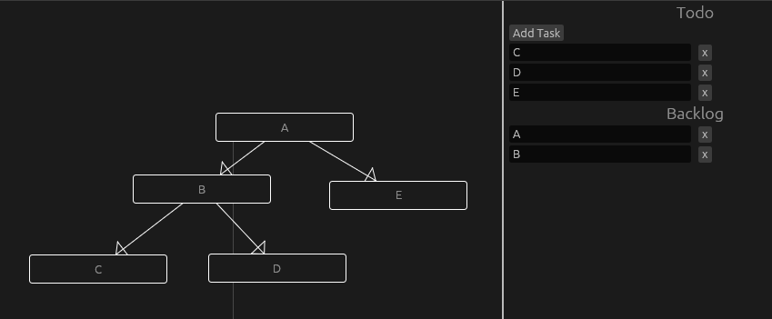

# Todosky
Todosky is a todo list generator where you add tasks and wire up dependencies.
Tasks with dependencies are put on your backlog, while tasks without dependencies are put on your todo list.
As a you complete tasks on your todo list, tasks automatically get moved off of your backlog.



# Compiling from Source

## Dependencies
* The [cargo](https://doc.rust-lang.org/cargo/getting-started/installation.html) build tool

## Compile Instructions
```
cargo build --release
```
After compiling, an executable will be located in `target/release`